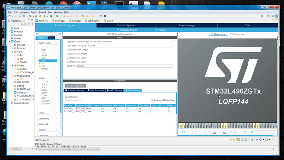
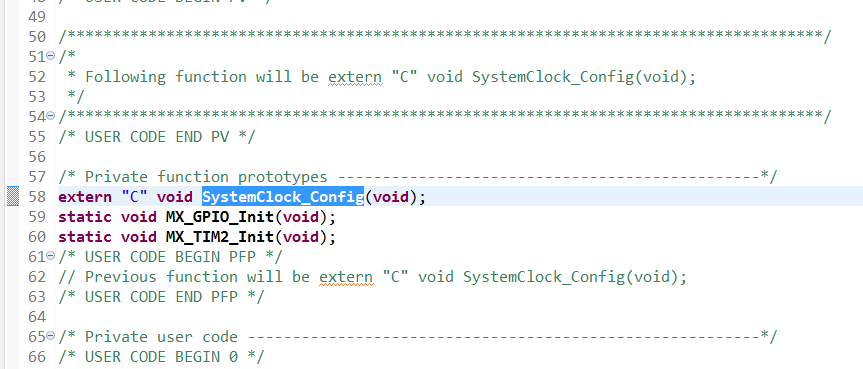

# STM32L496ZGTx C++ Code Base.
<br>

Because of C++ incompatibility some extra code part is needed to apply. <br /> 
In main.cpp modify the function definition as :<br />
```c
extern "C" void SystemClock_Config(void);
```
<br>
But this changes is not required in case of STM32F103C8T6 . Do not know why.<br />
___

### Class design RFFC

There are some issues about RFFC5071 chip communication. According to some codes from web:

```c
/*
	 * As described in
	 * integrated_synthesizer_mixer_register_map_programming_guide.pdf Page-6 2.2.1 Three-Wire Bus Read Operation
	 *
	 * Also from https://github.com/mossmann/hackrf/blob/master/firmware/common/rffc5071_spi.c
	 * Line 128
	 *
	 * SPI register read.
	 *
	 * Send 9 bits:
	 *   first bit is ignored,
	 *   second bit is one for read operation,
	 *   next 7 bits are register address.
	 * Then receive 16 bits (register value).
	 *
	 * At Line 153 it states that:
	 * The device requires two clocks while ENX is high before a serial
	 * transaction.  This is not clearly documented.
	 *
	 *
	 */
```
<br />
The communication with RFFC requires a manual clock and pulse from host processor. The timing for clock and pulse is generated by using
Timer2 . The delay code:

```c
void delay_us (uint32_t us, TIM_HandleTypeDef *htim)
{
	__HAL_TIM_SET_COUNTER(htim,0);  // set the counter value a 0
	while (__HAL_TIM_GET_COUNTER(htim) < us);  // wait for the counter to reach the us input in the parameter
}
```

___

Adding support for both RFFC chip.
